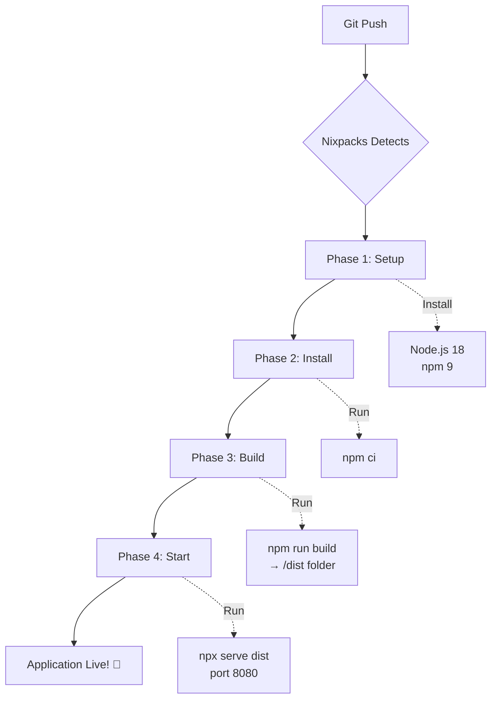

# 🎯 Nixpacks Fix - Visual Overview

## ❌ Problem: Before Fix

```
Browser Request
    ↓
Nixpacks Platform
    ↓
??? (No proper build/serve configuration)
    ↓
❌ Failed to load main.tsx
❌ MIME type error
❌ Application broken
```

**Error Message:**
```
main.tsx:1 Failed to load module script: Expected a JavaScript-or-Wasm 
module script but the server responded with a MIME type of "".
```

---

## ✅ Solution: After Fix

```
Browser Request
    ↓
Nixpacks Platform
    ↓
    ├─ [Setup] Install Node.js 18 + npm 9
    ├─ [Install] npm ci (install dependencies)
    ├─ [Build] npm run build (compile Vite app → /dist)
    └─ [Start] npx serve dist -s -l 8080
    ↓
✅ Static files served with correct MIME types
✅ Application working perfectly
```

---

## 📁 File Changes

### Created Files (5):

```
✅ nixpacks.toml
   └─ Tells Nixpacks how to build & serve

✅ DEPLOYMENT_CHECKLIST.md
   └─ Step-by-step deployment guide

✅ NIXPACKS_DEPLOYMENT_FIX.md
   └─ Detailed problem & solution explanation

✅ NIXPACKS_QUICK_DEPLOY.md
   └─ Quick reference & troubleshooting

✅ NIXPACKS_FIX_SUMMARY.md
   └─ TL;DR version
```

### Modified Files (3):

```
📝 package.json
   ├─ Added: "start": "serve dist -s -l 8080"
   └─ Added: "serve": "^14.2.4" dependency

📝 package-lock.json
   └─ Auto-generated (npm install)

📝 README.md
   └─ Added deployment options section
```

---

## 🔄 Deployment Flow

### Nixpacks Deployment Phases:



---

## 🆚 Comparison: Docker vs Nixpacks

| Feature | Docker (Existing) | Nixpacks (New) |
|---------|-------------------|----------------|
| **Build** | Multi-stage Dockerfile | nixpacks.toml |
| **Web Server** | Nginx | serve package |
| **Configuration** | Manual Dockerfile + nginx.conf | Auto-detected + nixpacks.toml |
| **Platform** | Any (VPS, Cloud, K8s) | Railway, Render, Heroku |
| **Setup Complexity** | Medium (need Docker knowledge) | Easy (push & deploy) |
| **Status** | ✅ Working | ✅ Fixed! |

**Both options are valid!** Choose based on your platform:
- **Nixpacks**: Best for Railway, Render
- **Docker**: Best for VPS, Kubernetes

---

## 🧪 Testing Matrix

### Local Test (Simulate Production)

```bash
# Step 1: Build
npm run build
# Expected: ✅ dist/ folder created

# Step 2: Serve
npm start
# Expected: ✅ Server running on port 8080

# Step 3: Test
Open http://localhost:8080
# Expected: ✅ No console errors
```

### Platform Test (After Deploy)

| Check | Expected Result |
|-------|----------------|
| Build logs | ✅ All phases complete |
| Application loads | ✅ Homepage visible |
| Console (F12) | ✅ No errors |
| Navigation | ✅ Routes working |
| Supabase | ✅ Connected |

---

## 🎯 Key Files Explained

### `nixpacks.toml`
**Purpose:** Configuration file for Nixpacks build system

**Content:**
- `[phases.setup]`: Install Node.js + npm
- `[phases.install]`: Install dependencies
- `[phases.build]`: Build application
- `[start]`: Start command
- `[variables]`: Environment variables

### `package.json` (Changes)
**Added:**
- **Script:** `"start"` - Production server command
- **Dependency:** `serve` - Static file server with proper MIME types

### Why `serve`?
- ✅ Lightweight static file server
- ✅ SPA routing support (`-s` flag)
- ✅ Correct MIME types for .js, .css, etc.
- ✅ Works with Nixpacks out of the box

---

## 🚀 Deployment Platforms

### ✅ Tested & Supported:

1. **Railway**
   - Auto-detects nixpacks.toml
   - Zero-config deployment
   - Auto-scaling

2. **Render**
   - Native Nixpacks support
   - Free tier available  
   - Custom domains

3. **Heroku** (with Nixpacks buildpack)
   - Add: `heroku buildpacks:set nixpacks`
   - Deploy: `git push heroku main`

### ✅ Alternative (Also Working):

4. **Docker** (existing config)
   - Uses nginx for serving
   - VPS deployment ready
   - Kubernetes compatible

5. **Vercel/Netlify**
   - Native Vite support
   - No nixpacks.toml needed
   - Automatic deployment

---

## 🎓 Lessons Learned

### Why Docker worked but Nixpacks didn't?

**Docker (Working):**
```dockerfile
# Multi-stage: Build → Copy → Serve
RUN npm run build
COPY --from=builder /app/dist /usr/share/nginx/html
CMD ["nginx", "-g", "daemon off;"]
```
→ Explicit build + Nginx serving with MIME config

**Nixpacks (Before):**
```
# No configuration
# Nixpacks guessed wrong
# Tried to serve source files directly
```
→ No build step, wrong MIME types

**Nixpacks (After):**
```toml
[phases.build]
cmds = ["npm run build"]

[start]
cmd = "npx serve dist -s -l 8080"
```
→ Explicit build + Proper static file serving

---

## 📞 Quick Links

| Document | Purpose |
|----------|---------|
| [NIXPACKS_FIX_SUMMARY.md](./NIXPACKS_FIX_SUMMARY.md) | ⚡ Quick reference |
| [NIXPACKS_DEPLOYMENT_FIX.md](./NIXPACKS_DEPLOYMENT_FIX.md) | 📖 Detailed explanation |
| [NIXPACKS_QUICK_DEPLOY.md](./NIXPACKS_QUICK_DEPLOY.md) | 🚀 Deploy guide |
| [DEPLOYMENT_CHECKLIST.md](./DEPLOYMENT_CHECKLIST.md) | ✅ Step-by-step |
| [README.md](./README.md) | 📚 Main documentation |

---

**Status:** ✅ Ready for deployment  
**Date:** 2025-12-04  
**Platform:** Nixpacks (Railway/Render) + Docker (VPS)
